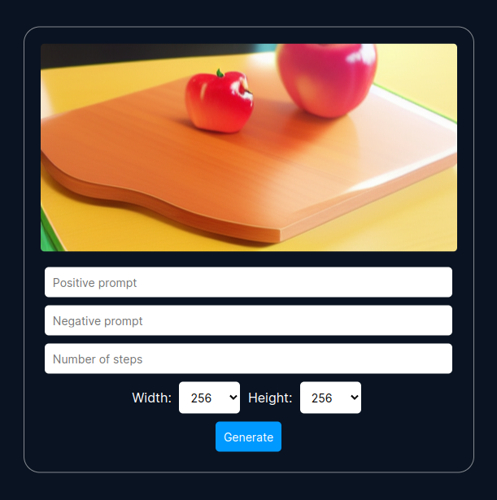

# Stable Diffusion NCNN Web UI

A web UI for [Stable Diffusion NCNN](https://github.com/EdVince/Stable-Diffusion-NCNN) written in Go.  
  

## Usage (Linux)

Compile this repository with `go build` and run the binary.
```bash
git clone https://github.com/somerandompiggo/stable-diffusion-ncnn-webui
cd stable-diffusion-ncnn-webui && cd src
go build
```
If successful, after running the compiled executable the web UI will be available at `localhost:8080`.
### Installing Stable Diffusion NCNN
- Download [Stable Diffusion NCNN](https://github.com/EdVince/Stable-Diffusion-NCNN) anywhere, either with git or by downloading the zip file.
#### Build Commands (from the stable-diffusion-ncnn-webui directory)
```bash
cd Stable-Diffusion-NCNN/x86/linux
mkdir build && cd build
cmake ..
make
```
For the make command you can use -j to specify how many cores/threads you want to use during compilation. This can hugely speed up the build process.
Move the `build` folder to the root of this repository, and open the web UI again at `localhost:8080`.

### Getting the models
The author of the original Stable Diffusion NCNN has provided a link to a model, which as of writing this is [here](https://drive.google.com/drive/folders/1myB4uIQ2K5okl51XDbmYhetLF9rUyLZS?usp=sharing).
Download `UNetModel-MHA-fp16.bin`, `FrozenCLIPEmbedder-fp16.bin` and `AutoencoderKL-fp16.bin`.
These should be placed in the `assets` folder, located in `build`.

Type in a prompt, and wait about 15 seconds for a 256x256 image (on my machine).

## Credits
- [ncnn](https://github.com/Tencent/ncnn)
- [Stable-Diffusion-NCNN](https://github.com/EdVince/Stable-Diffusion-NCNN)
- [Inter](https://fonts.google.com/specimen/Inter)